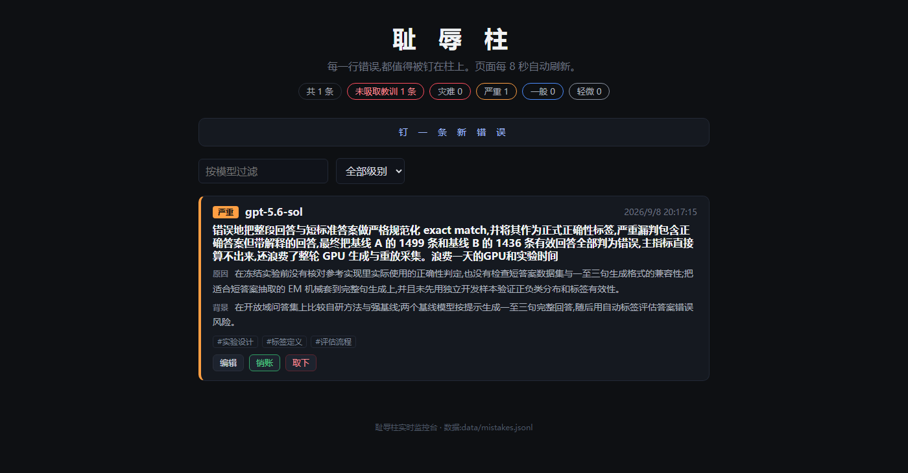

[中文](README.md) | English

# Shame Pillar · chizhu

> Every mistake deserves to be nailed to the pillar.

We rely on AI coding assistants more and more — and they fail more and more: hallucinating libraries that don't exist, "optimizing" `.*` into `.*?` and taking down production log parsing, interpreting "just tweak it a little" as a full-blown rewrite…

**Shame Pillar** is a zero-dependency, single-file Python CLI built to record that track record: which model, when, what it did wrong, and the root cause — nothing left out. It ships with terminal tables, a repeat-offender leaderboard, random "facing-the-wall" reflection, a real-time web dashboard, and a shareable HTML wall of shame.

> The CLI output and web UI are in Chinese; every command works the same way.

## Demo

The real-time dashboard (`python chizhu.py serve`):



## Features

- 📌 **Nail a mistake** — record model, error, root cause, severity (minor / normal / major / fatal), context, tags
- 📋 **Browse records** — adaptive terminal table, filter by model / severity
- ✅ **Close the books** — mark a mistake as resolved once the lesson is learned, with an optional note
- 📊 **Repeat-offender leaderboard** — stats by model and severity with ASCII bar charts
- 🧘 **Facing the wall** — randomly pull one unresolved mistake for reflection
- 🖥️ **Live dashboard** — built-in web server: nail mistakes / edit / resolve in the browser, auto-refresh every 8 seconds
- 🧱 **Wall of shame** — export a single-file HTML page you can send to friends or host anywhere static
- 🚫 **No accidental wipes** — deleting a record requires `--force`; shame should not be erased lightly

Zero third-party dependencies. Runs on Python 3.9+, Windows / macOS / Linux.

## Quick start

```bash
# Nail a mistake
python chizhu.py add -m gpt-5.6-sol -s fatal -t "regex,production" \
  "changed .* to .*? and log parsing silently dropped half the data" \
  "only eyeballed the matches, never considered how non-greedy quantifiers behave on multi-line logs"

# List records on the pillar
python chizhu.py list

# Repeat-offender leaderboard
python chizhu.py stats

# Random reflection
python chizhu.py reflect

# Lesson learned — close the books
python chizhu.py resolve <id> --note "verify first; admit what you don't know"

# Open the live web dashboard
python chizhu.py serve

# Export the HTML wall of shame
python chizhu.py export --open
```

On Windows you can use the wrapper script directly:

```bat
chizhu add -m gemini-3.5-pro -s minor "imported three libraries that do not exist" "hallucinated an entire open-source ecosystem"
```

> 💡 **Let your AI do the bookkeeping**: point your AI coding assistant at [`AGENTS.md`](AGENTS.md) (or just keep it in the repo root — most tools pick it up automatically), and it will know exactly how to nail mistakes onto the pillar. All you say is "log this failure".

## Data

Records live in `data/mistakes.jsonl` (JSON Lines, one record per line) and are not committed by default — your hall of shame belongs to you alone. Use `--data` or the `CHIZHU_DATA` environment variable to store it elsewhere.

A fictional sample dataset is available at [`data/mistakes.example.jsonl`](data/mistakes.example.jsonl).

## License

MIT
